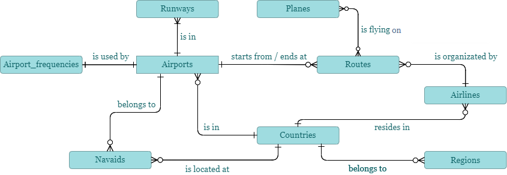
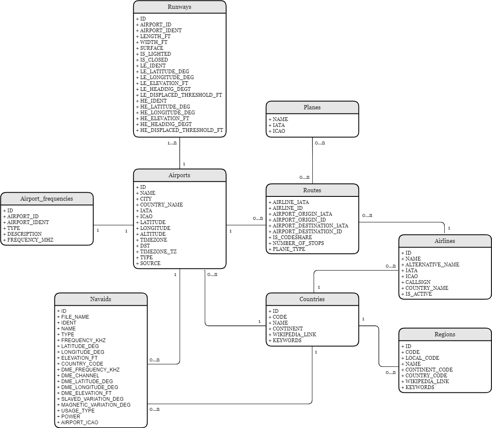
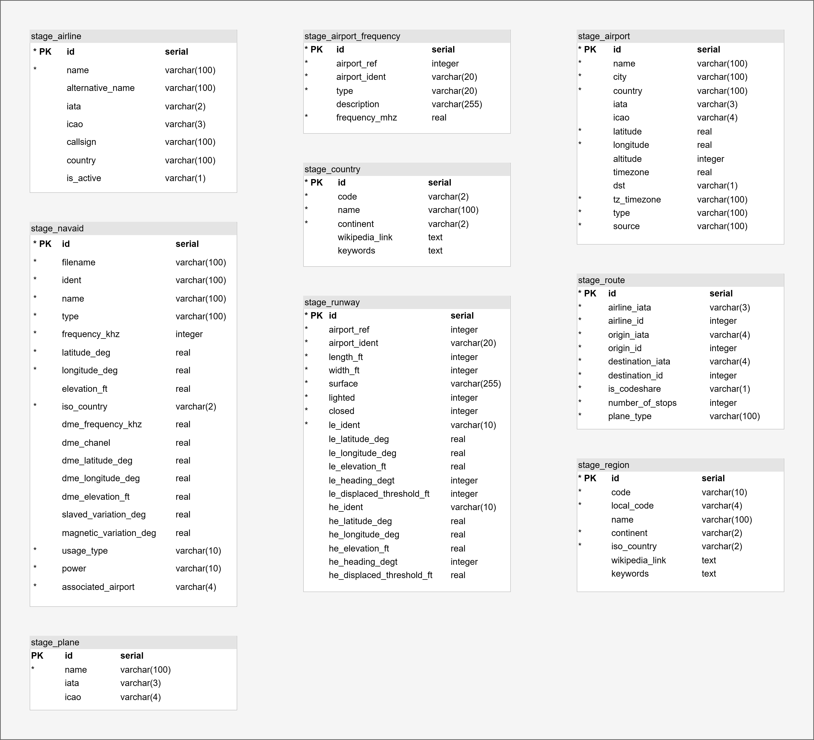
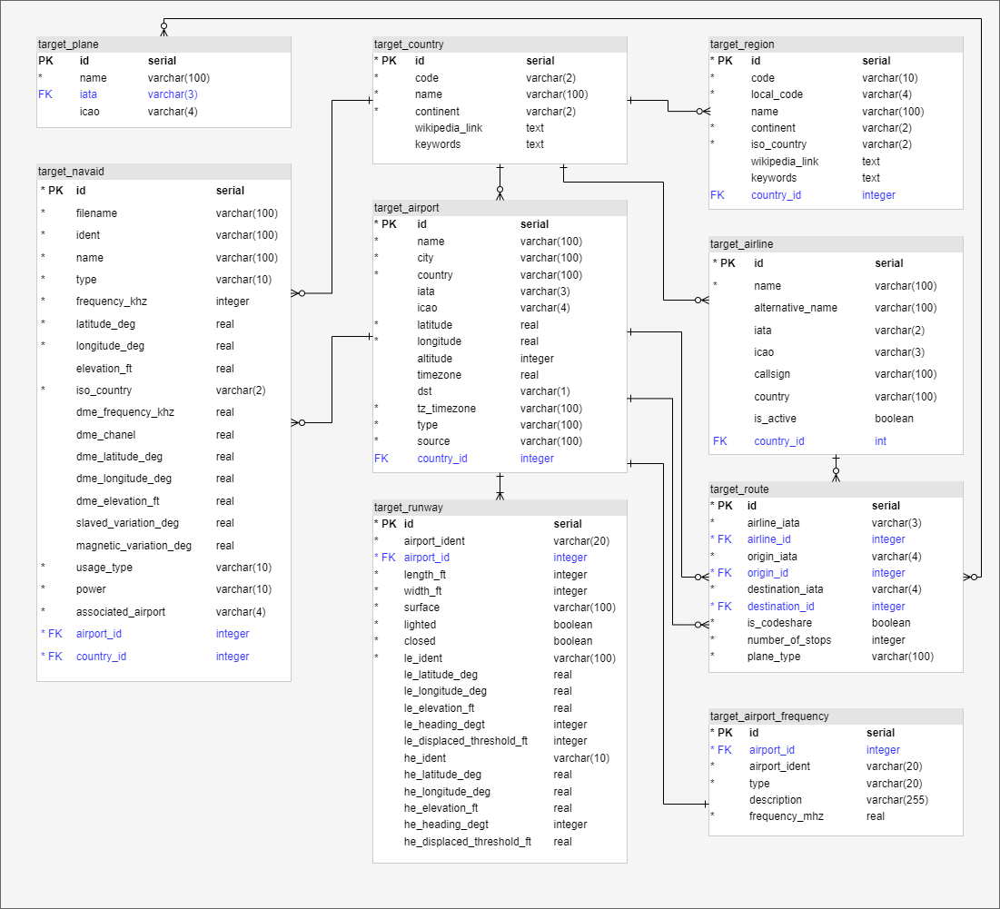

# Homework 1 - Airports - Input data analysis, entity, conceptual and DB model designs

Authors: Hrytsyna, Anastasiia Solomiia; Pilar, Michal

Description: Text description of source data (detailed description of individual attributes including data types, business names and business data description), entity model of the target, DB model of stage and target.

## Table of contents

-  **data/airports** - input data from the [Airline dataset](data/airports)
-  **description.pdf** - source data description (also, the whole table may be found on the [link](https://docs.google.com/spreadsheets/d/1cScxtG2dii9vaiXkGowC0mQoljptH3gNJ2PgaUXw2UQ/edit?usp=sharing) (`Source data description` sheet))
-  **entity_model.png** - entity–relationship model
-  **conceptual_model.png** - conceptual model
-  **stage_moodel.png** - DB stage model
-  **target_moodel.png** - DB target model

## DB Models

### Conceptual Model

### Entity Model

### Stage Model

### Target Model

