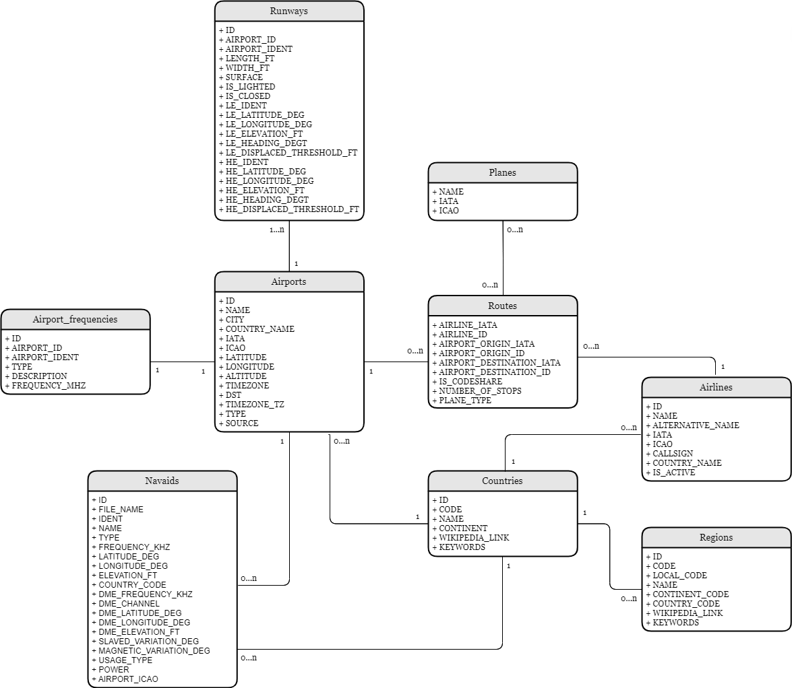
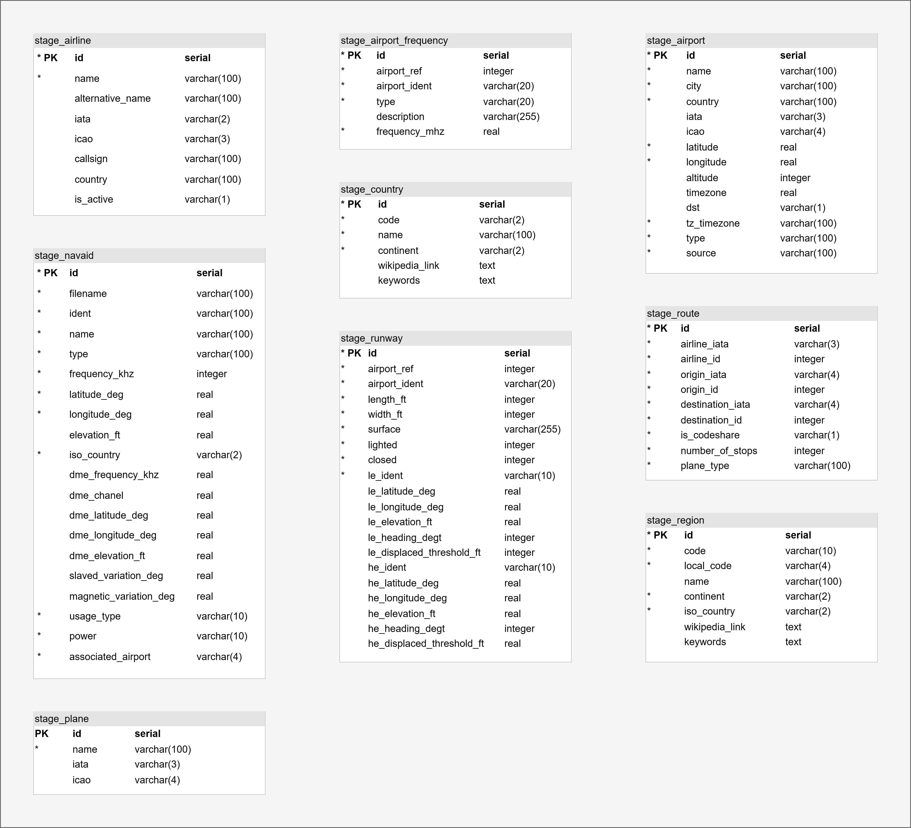
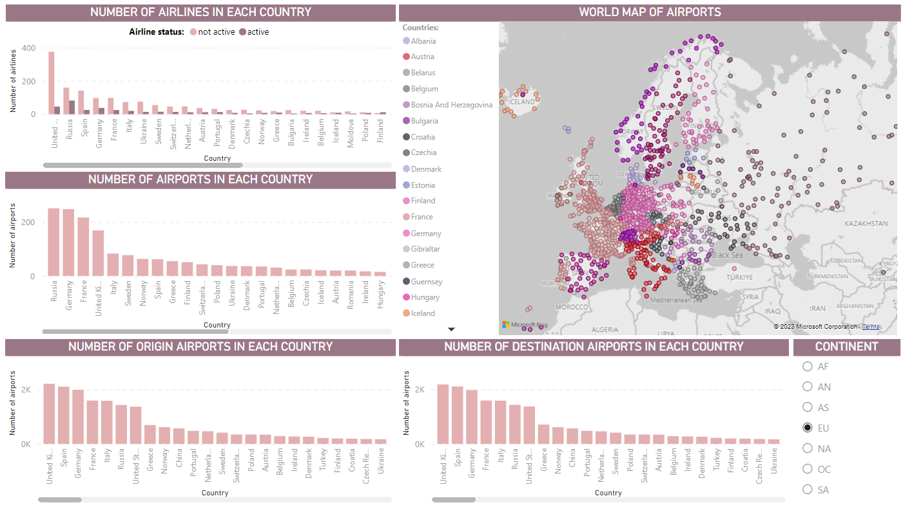

# Enterprise Data Warehouse Project

> **Authors:** Anastasiia Solomiia Hrytsyna & Michal Pilař

# Homework 1 - Airports - Input data analysis, entity, conceptual and DB model designs

Authors: Hrytsyna, Anastasiia Solomiia; Pilar, Michal

Description: Text description of source data (detailed description of individual attributes including data types, business names and business data description), entity model of the target, DB model of stage and target.

## Table of contents

-  **data/airports** - input data from the [Airline dataset](01/data/airports)
-  **description.pdf** - source data description (also, the whole table may be found on the [link](https://docs.google.com/spreadsheets/d/1cScxtG2dii9vaiXkGowC0mQoljptH3gNJ2PgaUXw2UQ/edit?usp=sharing) (`Source data description` sheet))
-  **entity_model.png** - entity–relationship model
-  **conceptual_model.png** - conceptual model
-  **stage_moodel.png** - DB stage model
-  **target_moodel.png** - DB target model

## DB Models

### Conceptual Model

### Entity Model

### Stage Model

### Target Model

# Homework 2
## DDL
DDL files for both **stage** and **target** databases are located in folder [ddl](02/ddl). 

## Data Logical Map
- [Online version of DLM](https://docs.google.com/spreadsheets/d/15keaDnY0M-4NTHTN8edKjNP4-NBBxgJ3TnaOgYQfxt4/edit?usp=sharing).
- Offline version of DLM is located in folder [dlm](02/dlm).

## ETL
- Stage ETL processes are located in folder [etl/stage](02/etl/stage).

- Target ETL processes are located in folder [etl/target](02/etl/target).

- The job **job_load_stage** located in the [etl](02/etl) folder loads data from files into the stage database. The job **job_load_target** located in the [etl](02/etl) folder processes data from the stage database and stores it into the target database. Both of these jobs are triggered by the summary job **job_load_all**, also located in [etl](02/etl) folder.

# Homework 3
## Datamart DDL
DDL file for the **datamart** database creation are located in [create_datamart](03/create_datamart.sql) file. 

## Datamart Description
- [Online version of datamart description](https://docs.google.com/spreadsheets/d/1nnv86LpwGWcTAm9msNONdS_62Sodc4vy7maayK3u1O8/edit?usp=sharing).
- Offline version of datamart description is located in [datamart_description](03/datamart_description.xlsx) file.

In the next picture datamart model is shown:

## Visualization in Power BI
All of the input data (views and tables) to the Power BI report are located at the [data](03/data) folder.
- [airline_view](03/airline_view.csv) - contains an information about airline (its name, origin country, activeness status)
- [airport_view](03/airport_view.csv) - contains an information about airport (its name and location)
- [countries_by_area](03/countries_by_area.csv) - contains an information about land area of each country ([data source](https://www.downloadexcelfiles.com/wo_en/list-largest-countries-world#google_vignette&gsc.tab=0))
- [country_view](03/country_view.csv) - contains a list of all countries and corresponding continents
- [route_coordinates_view](03/route_coordinates_view.csv) - contains an information about route start & end destination locations + distance between them
- [route_info_view](03/route_info_view.csv) - contains whole details about route (airline, start & end airports, flight distance, plane type, number of stops, etc.)

Finally, Power BI report is located in the [visualization](03/visualization.pbix) file.
## Questions
- **Between which airports occured the longest flight?**

First of all, we decided to display a vertical barchart of the total distance for each route and sort it in descending order.

As we may see from the picture below, the first 4 longest flights look a bit strange. It is 2 pairs of return flights: Lusaka - Solwesi and Ndola - Solwesi and all of the cities are located in Zambia. So, it is very unusual that flight within one country can be soo long (approximately 16K km). Moreover, J32 and J32 J41 planes have been used without any stop. Both of these planes are designed to flight on shorter distances, so for them it is physically impossible to manage such flight (see source [here](https://en.wikipedia.org/wiki/Saab_32_Lansen) and [here](https://en.wikipedia.org/wiki/British_Aerospace_Jetstream)). 

With these facts we decided to consider first 4 flights as an error in the input information, so the winner is **5th route** (#6882) in the chart (see picture below). 

- **Which European country has the densest airport network?**

In this part we decided to visualize all airports locations on the map and general statistics for each country (number of airlines, airports, routes to/from the country). As we may see from the graphs below it seems that in Europe Russia has the biggest amount of the airports (251) and active native airlines (82) - which is quite logical, as it is the biggest country. Despite this fact, it seems that United Kingdom handle the biggest amount of flights to (2212) and from (2188) its country and it also has the bigges amount of all airlines (421 - not just active ones).

Still, to solve our question we have to discover the density of the network in each country. That is why we have to compare general statistics to each country land area (it is important to mention that during this step we added some helpful data for our future calculations: [countries_by_area.csv](03/countries_by_area.csv)). For doing this we created a table with general statistics from the previous step, where we divided all of the numbers to the land area (to calculate density). See the example below...

After all calculations we get the next results:
- the highest density of native airlines has **Monaco** (49.5 per km2), as its territory is really small (2 km2) and it has 1 airline 
- the highest density of airports has **Malta** (0.63 per km2), due to the same reason - small country with 2 airports per 316 km2; also, we ignored Gibraltar, Guernsey and Jersey (with better statistics), as they are not countries, so it is just a mistake in data
- and last but not least, the champion in the flight density is also **Malta**, as it has 84 to and from flights, which is 26.6 per 316 km2
